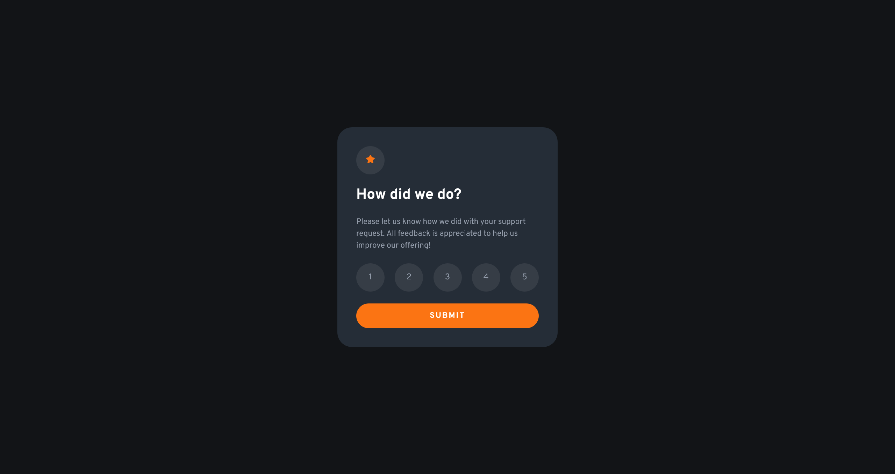
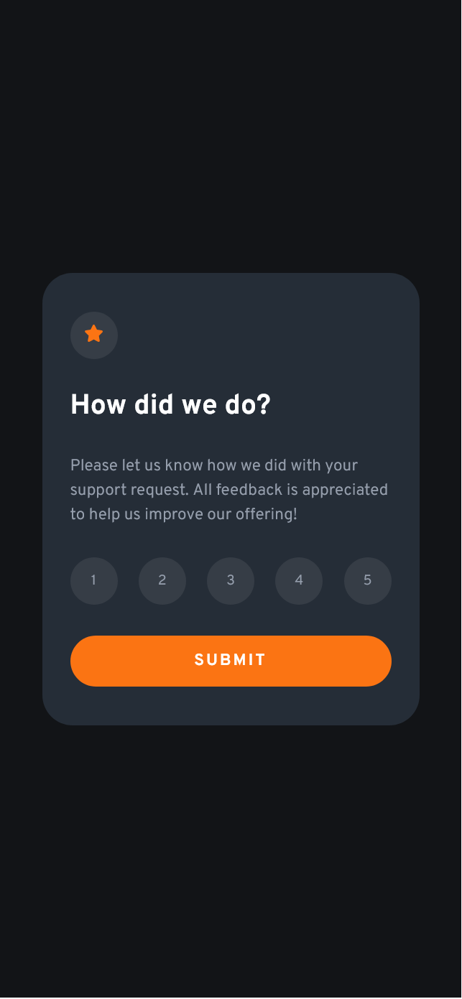

# ⭐ Interactive Rating Component

Repositório dedicado ao exercício ["Interactive Rating Component"](https://www.frontendmentor.io/challenges/interactive-rating-component-koxpeBUmI) do site [Frontend Mentor](https://www.frontendmentor.io).

## 🎯Desafio

"This is a nice, small project to practice handling user interactions and updating the DOM. Perfect for anyone who has learned the basics of JavaScript!"

*(Este é um pequeno e agradável projeto para praticar o tratamento das interacções do utilizador e a atualização do DOM. Perfeito para quem já aprendeu o básico de JavaScript!)*

### ⚒️ Tecnologias utilizadas 
- HTML5
- CSS3
- JavaScript

### 🤩 Resultado

- [Confira aqui o resultado!](https://fem-vn-interactive-rating-component.netlify.app)

### 📱 Screenshots

  
Desktop:

  </img>
  </img>   

  
Mobile:

  </img>
  </img>

